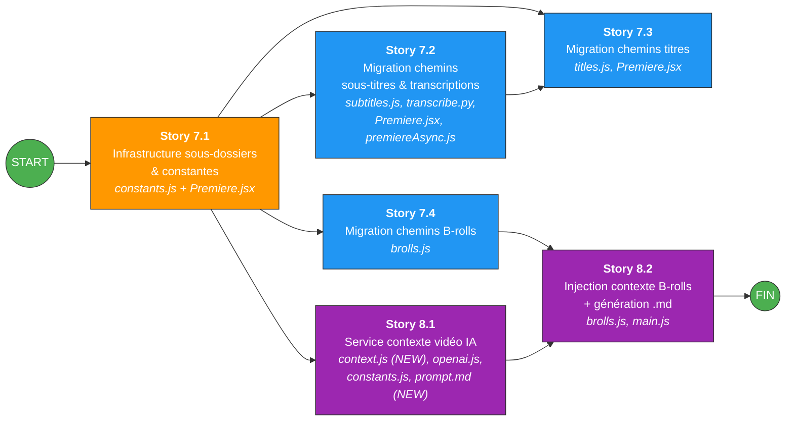

```mermaid
graph LR
    START((START)) --> S71

    S71["<b>Story 7.1</b><br/>Infrastructure sous-dossiers<br/>& constantes<br/><i>constants.js + Premiere.jsx</i>"]

    S71 --> S72
    S71 --> S73
    S71 --> S74
    S71 --> S81

    S72["<b>Story 7.2</b><br/>Migration chemins<br/>sous-titres & transcriptions<br/><i>subtitles.js, transcribe.py,<br/>Premiere.jsx, premiereAsync.js</i>"]

    S73["<b>Story 7.3</b><br/>Migration chemins titres<br/><i>titles.js, Premiere.jsx</i>"]

    S74["<b>Story 7.4</b><br/>Migration chemins B-rolls<br/><i>brolls.js</i>"]

    S81["<b>Story 8.1</b><br/>Service contexte vidéo IA<br/><i>context.js (NEW), openai.js,<br/>constants.js, prompt.md (NEW)</i>"]

    S72 --> S73
    S74 --> S82
    S81 --> S82

    S82["<b>Story 8.2</b><br/>Injection contexte B-rolls<br/>+ génération .md<br/><i>brolls.js, main.js</i>"]

    S82 --> FIN((FIN))

    style START fill:#4CAF50,stroke:#333,color:#fff
    style FIN fill:#4CAF50,stroke:#333,color:#fff
    style S71 fill:#FF9800,stroke:#333,color:#fff
    style S72 fill:#2196F3,stroke:#333,color:#fff
    style S73 fill:#2196F3,stroke:#333,color:#fff
    style S74 fill:#2196F3,stroke:#333,color:#fff
    style S81 fill:#9C27B0,stroke:#333,color:#fff
    style S82 fill:#9C27B0,stroke:#333,color:#fff
```
