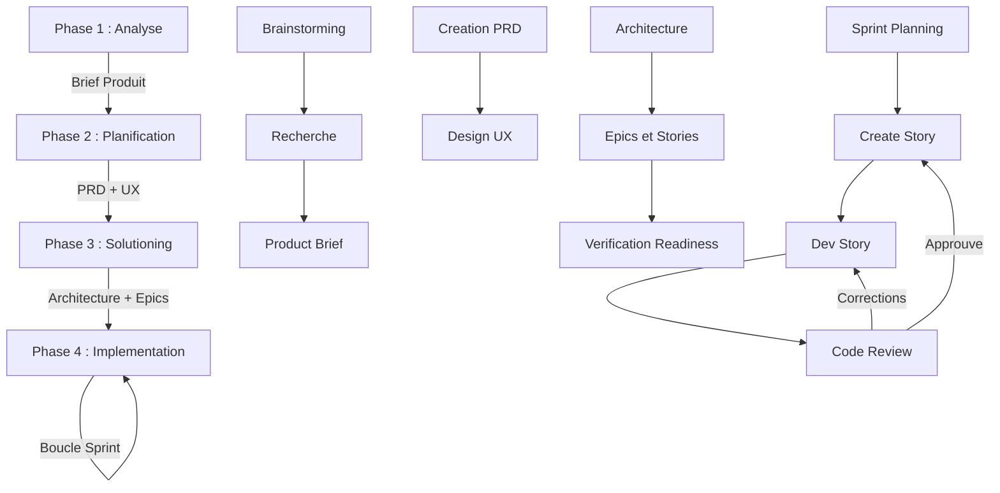

# Tutoriel BMAD Method v6 - Guide Complet pour le Developpement Web

> **BMAD** = **B**reakthrough **M**ethod of **A**gile AI **D**riven Development
> Version : 6.0.0-Beta.7 | Langue : Francais

---

## Table des matieres

1. [Qu'est-ce que BMAD ?](#1-quest-ce-que-bmad-)
2. [Prerequis et Installation](#2-prerequis-et-installation)
3. [Structure du Projet](#3-structure-du-projet-apres-installation)
4. [Les Agents et Leurs Roles](#4-les-agents-bmad-et-leurs-roles)
5. [Parcours Complet : Les 4 Phases](#5-parcours-complet--les-4-phases-du-developpement)
6. [Parcours Quick Flow](#6-parcours-quick-flow--pour-les-projets-simples)
7. [Exemple Pratique : Plateforme E-Commerce](#7-exemple-pratique--plateforme-e-commerce)
8. [Reference des Commandes Slash](#8-reference-des-commandes-slash)
9. [Gestion du Contexte et Artefacts](#9-gestion-du-contexte-et-artefacts)
10. [Conseils et Bonnes Pratiques](#10-conseils-et-bonnes-pratiques)

---

## 1. Qu'est-ce que BMAD ?

### 1.1 Definition

BMAD (Breakthrough Method of Agile AI Driven Development - Methode de Rupture pour le Developpement Agile Pilote par l'IA) est un framework open-source qui integre des **agents IA specialises** dans un processus de developpement agile structure.

Contrairement aux outils IA classiques qui generent du code de maniere isolee, BMAD utilise une approche d'**ingenierie de contexte progressive** : chaque phase du developpement produit des documents qui alimentent la phase suivante, garantissant coherence et qualite.

### 1.2 Philosophie

Les principes fondamentaux de BMAD :

- **Les agents IA sont des collaborateurs experts, pas des generateurs de code** : ils facilitent votre reflexion, posent les bonnes questions, et vous guident a travers des processus structures.
- **Ingenierie de contexte** : chaque document produit (brief, PRD, architecture, stories) devient le contexte pour l'etape suivante. L'IA ne travaille jamais "a l'aveugle".
- **Adaptation au projet** : BMAD ajuste automatiquement la rigueur de planification en fonction de la complexite du projet. Un simple bug fix n'a pas besoin du meme processus qu'une plateforme SaaS.
- **Humain aux commandes** : vous prenez toutes les decisions. Les agents vous guident et vous challengent, mais ne decident pas a votre place.

### 1.3 Les deux parcours disponibles

BMAD propose deux chemins selon la complexite de votre projet :

| Critere | Parcours Complet (4 Phases) | Quick Flow |
|---------|----------------------------|------------|
| **Ideal pour** | Projets complexes, nouvelles applications, equipes | Bugs, petites fonctionnalites, prototypes |
| **Nombre de stories** | 10 a 50+ | 1 a 15 |
| **Phases** | Analyse > Planification > Solutioning > Implementation | Quick Spec > Quick Dev > Code Review |
| **Documents produits** | Brief, PRD, UX, Architecture, Epics, Stories | Tech-Spec uniquement |
| **Duree typique** | Plusieurs sessions | 1 a 3 sessions |

> **Regle importante** : Demarrez TOUJOURS un **nouveau chat** pour chaque workflow/commande. Ne melangez jamais plusieurs workflows dans une meme conversation.

---

## 2. Prerequis et Installation

### 2.1 Prerequis techniques

- **Node.js v20+** (requis pour l'installeur)
- **Git** (recommande pour le controle de version)
- **Un IDE compatible** : Claude Code (recommande), Cursor, Windsurf, Kiro, ou autre
- **Une idee de projet** (meme simple !)

Verifiez vos versions :
```bash
node --version   # doit afficher v20.x.x ou superieur
git --version    # recommande
```

### 2.2 Installation de BMAD

#### Methode interactive (recommandee pour les debutants)

```bash
# Creez votre dossier de projet
mkdir mon-projet-web
cd mon-projet-web

# Lancez l'installeur interactif
npx bmad-method install
```

L'installeur vous guidera a travers :
1. **Repertoire d'installation** : confirmez le dossier courant
2. **Modules** : selectionnez "BMad Method" (BMM)
3. **IDE/Outils** : choisissez votre IDE (ex: Claude Code)
4. **Configuration** :
   - `project_name` : le nom de votre projet
   - `user_skill_level` : beginner / intermediate / expert
   - `communication_language` : French (pour les interactions en francais)
   - `document_output_language` : French (pour les documents en francais)
   - `output_folder` : dossier de sortie (defaut : `_bmad-output`)

#### Methode non-interactive (pour l'automatisation)

```bash
npx bmad-method install \
  --directory . \
  --modules bmm \
  --tools claude-code \
  --communication-language French \
  --document-output-language French \
  --output-folder _bmad-output \
  --yes
```

### 2.3 Verification de l'installation

Apres l'installation, ouvrez votre IDE dans le dossier du projet et lancez :

```
/bmad-help
```

Cette commande vous affichera :
- L'etat de votre projet (phase actuelle)
- Les prochaines etapes recommandees
- Les commandes disponibles

---

## 3. Structure du Projet apres Installation

### 3.1 Arborescence complete

```
mon-projet-web/
|
+-- _bmad/                          # Cerveau de BMAD (ne pas modifier)
|   +-- _config/                    # Configuration et manifestes
|   |   +-- manifest.yaml           # Manifeste d'installation
|   |   +-- agents/                 # Agents compiles
|   |   +-- bmad-help.csv           # Catalogue d'aide contextuelle
|   |   +-- agent-manifest.csv      # Catalogue des agents
|   |   +-- workflow-manifest.csv   # Catalogue des workflows
|   |   +-- task-manifest.csv       # Catalogue des taches
|   |
|   +-- bmm/                        # Module BMad Method
|   |   +-- agents/                 # 9 agents specialises
|   |   +-- config.yaml             # Configuration du module
|   |   +-- data/                   # Templates et donnees
|   |   +-- teams/                  # Compositions d'equipes
|   |   +-- workflows/              # Tous les workflows par phase
|   |       +-- 1-analysis/         # Phase 1 : workflows d'analyse
|   |       +-- 2-plan-workflows/   # Phase 2 : workflows de planification
|   |       +-- 3-solutioning/      # Phase 3 : workflows de solutioning
|   |       +-- 4-implementation/   # Phase 4 : workflows d'implementation
|   |       +-- bmad-quick-flow/    # Quick Flow (parcours rapide)
|   |       +-- document-project/   # Documentation de projet
|   |       +-- generate-project-context/  # Generation de contexte
|   |       +-- qa/                 # QA et tests
|   |
|   +-- core/                       # Module de base
|   |   +-- agents/                 # Agent BMad Master
|   |   +-- tasks/                  # Taches utilitaires (aide, revues)
|   |   +-- workflows/              # Brainstorming, Party Mode
|   |
|   +-- _memory/                    # Memoire persistante des agents
|
+-- _bmad-output/                   # Artefacts generes
|   +-- planning-artifacts/         # Documents de planification (PRD, architecture, epics)
|   +-- implementation-artifacts/   # Documents d'implementation (stories, sprints)
|
+-- .claude/                        # Commandes Claude Code
|   +-- commands/                   # Commandes slash auto-generees
|       +-- bmad-agent-*.md         # Commandes de chargement d'agents
|       +-- bmad-bmm-*.md           # Commandes de workflows
|       +-- bmad-*.md               # Commandes utilitaires
|
+-- docs/                           # Documentation du projet
```

### 3.2 Explication des dossiers cles

| Dossier | Role | A modifier ? |
|---------|------|-------------|
| `_bmad/` | Contient toute la logique BMAD (agents, workflows, config) | Non - gere par l'installeur |
| `_bmad-output/planning-artifacts/` | Documents de planification (PRD, architecture, epics) | Non - genere par les agents |
| `_bmad-output/implementation-artifacts/` | Stories, sprint status, revues de code | Non - genere par les agents |
| `.claude/commands/` | Commandes slash pour Claude Code | Non - auto-genere |
| `docs/` | Documentation de votre projet | Oui - vos documents |

### 3.3 Le fichier de configuration

Le fichier `_bmad/bmm/config.yaml` contient votre configuration :

```yaml
project_name: mon-projet-web
user_skill_level: intermediate
planning_artifacts: "{project-root}/_bmad-output/planning-artifacts"
implementation_artifacts: "{project-root}/_bmad-output/implementation-artifacts"
project_knowledge: "{project-root}/docs"
communication_language: French
document_output_language: French
output_folder: _bmad-output
```

---

## 4. Les Agents BMAD et Leurs Roles

### 4.1 Vue d'ensemble

BMAD utilise **9 agents specialises** + 1 orchestrateur. Chaque agent a :
- Un **nom et une personnalite** (persona)
- Un **style de communication** unique
- Des **principes** qu'il suit rigoureusement
- Des **workflows** qu'il execute

Les agents sont actives automatiquement par les commandes slash, ou peuvent etre charges directement.

### 4.2 Tableau recapitulatif

| Agent | Persona | Phase(s) | Role principal |
|-------|---------|----------|----------------|
| Mary (Analyste) | Analyste Business Strategique | Phase 1 | Recherche, brainstorming, brief produit |
| John (Product Manager) | Chef de Produit, 8+ ans d'experience | Phases 2-3 | PRD, epics et stories, validation |
| Winston (Architecte) | Architecte Systeme, pragmatique | Phase 3 | Decisions techniques, ADR, verification |
| Amelia (Developpeuse) | Ingenieure Senior, ultra-precise | Phase 4 | Implementation, revue de code |
| Bob (Scrum Master) | Maitre de Melee, certifie | Phase 4 | Sprint planning, creation de stories |
| Quinn (QA) | Ingenieur QA, pragmatique | Phase 4 | Tests automatises API et E2E |
| Sally (UX Designer) | Designer UX, 7+ ans d'experience | Phase 2 | Design UX/UI, experience utilisateur |
| Barry (Quick Flow) | Dev Solo Full-Stack, elite | Quick Flow | Spec rapide, dev rapide |
| Paige (Tech Writer) | Redactrice Technique | Toutes | Documentation, diagrammes, standards |
| BMad Master | Orchestrateur | Toutes | Aide contextuelle, gestion des taches |

### 4.3 Details des agents cles pour le web

#### Mary - L'Analyste (Phase 1)

- **Personnalite** : Excitee comme une chasseuse de tresors, decouvre des patterns caches
- **Communication** : Precision structuree, enthusiasm contagieux
- **Specialite** : Transforme des idees vagues en briefs produit concrets
- **Commande** : `/bmad-agent-bmm-analyst`
- **Workflows** : Brainstorming, Recherche (marche/domaine/technique), Creation du brief

#### John - Le Product Manager (Phases 2-3)

- **Personnalite** : Pose des "POURQUOI" sans relache, rigoureux avec les donnees
- **Communication** : Direct, precis, challenge vos hypotheses
- **Specialite** : Cree des PRD complets avec exigences fonctionnelles et non-fonctionnelles
- **Commande** : `/bmad-agent-bmm-pm`
- **Workflows** : Creation/Validation/Edition du PRD, Creation des epics et stories

#### Winston - L'Architecte (Phase 3)

- **Personnalite** : Calme, pragmatique, equilibre vision et realite
- **Communication** : Ponderee, explique les compromis techniques
- **Specialite** : Decisions d'architecture (API, base de donnees, framework, patterns)
- **Commande** : `/bmad-agent-bmm-architect`
- **Workflows** : Creation de l'architecture (avec ADR), verification de readiness

#### Amelia - La Developpeuse (Phase 4)

- **Personnalite** : Ultra-succincte, obsedee par la precision, "parle en chemins de fichiers"
- **Communication** : Minimum de mots, maximum de code
- **Regles critiques** :
  - Lit TOUTE la story avant de coder
  - Execute les taches DANS L'ORDRE
  - Ecrit les tests AVEC l'implementation
  - Lance la suite de tests complete apres chaque tache
  - Ne passe jamais a la tache suivante si les tests echouent
- **Commande** : `/bmad-agent-bmm-dev`
- **Workflows** : Dev Story, Code Review

#### Bob - Le Scrum Master (Phase 4)

- **Personnalite** : Crisp, pilote par les checklists, zero ambiguite
- **Communication** : Structuree, orientee action
- **Specialite** : Gestion de sprint, creation de stories detaillees
- **Commande** : `/bmad-agent-bmm-sm`
- **Workflows** : Sprint Planning, Creation de stories, Retrospective

#### Sally - La Designer UX (Phase 2)

- **Personnalite** : Empathique, raconte des histoires avec les mots
- **Communication** : Peinture verbale, centree sur l'utilisateur
- **Specialite** : Design d'experience utilisateur, responsive, accessibilite
- **Commande** : `/bmad-agent-bmm-ux-designer`
- **Workflows** : Creation du design UX

#### Barry - Le Quick Flow Dev (Parcours rapide)

- **Personnalite** : Direct, confiant, oriente implementation
- **Communication** : Pragmatique, "le code qui marche vaut mieux que le code parfait qui n'existe pas"
- **Specialite** : Specifications et developpement rapides pour les petits projets
- **Commande** : `/bmad-agent-bmm-quick-flow-solo-dev`
- **Workflows** : Quick Spec, Quick Dev, Code Review

---

## 5. Parcours Complet : Les 4 Phases du Developpement

Le parcours complet suit une progression logique en 4 phases. Chaque phase produit des documents qui alimentent la suivante.



---

### 5.1 Phase 1 : Analyse (Optionnelle)

La phase d'analyse est optionnelle mais **fortement recommandee** pour les nouveaux projets. Elle vous aide a clarifier votre vision avant de plonger dans les details.

**Agent principal** : Mary (Analyste)

#### 5.1.1 Brainstorming (optionnel)

```
/bmad-brainstorming
```

Mary facilite une session de brainstorming structuree en utilisant des techniques professionnelles (SCAMPER, Mind Mapping, Six Thinking Hats, etc.).

**Ce que fait le workflow** :
1. Configuration de la session (theme, objectifs)
2. Selection de la technique de brainstorming
3. Execution guidee de la technique
4. Organisation et synthese des idees

**Artefact produit** : Rapport de brainstorming

#### 5.1.2 Recherche (optionnelle)

Trois types de recherche sont disponibles :

| Commande | Type | Ce que ca explore |
|----------|------|-------------------|
| `/bmad-bmm-market-research` | Marche | Concurrence, besoins clients, tendances |
| `/bmad-bmm-domain-research` | Domaine | Industrie, reglementation, bonnes pratiques |
| `/bmad-bmm-technical-research` | Technique | Faisabilite, options d'architecture, technologies |

Chaque recherche suit 6 etapes guidees et produit un document de synthese.

#### 5.1.3 Creation du Product Brief (recommande)

```
/bmad-bmm-create-product-brief
```

C'est le workflow le plus important de la Phase 1. Mary vous guide a travers 6 etapes pour transformer votre idee en brief executif :

| Etape | Contenu |
|-------|---------|
| 1. Init | Configuration et contexte initial |
| 2. Vision | Capture de la vision strategique du produit |
| 3. Utilisateurs | Definition des personas et besoins utilisateurs |
| 4. Metriques | Definition des criteres de succes mesurables |
| 5. Perimetre | Definition du perimetre MVP (Minimum Viable Product) |
| 6. Finalisation | Synthese et generation du document final |

**Artefact produit** : `product-brief.md` dans `_bmad-output/planning-artifacts/`

> **Conseil web** : Lors de l'etape "Utilisateurs", pensez a decrire les differents types d'utilisateurs de votre application web (visiteur, utilisateur inscrit, administrateur, etc.)

---

### 5.2 Phase 2 : Planification (Requise)

La phase de planification est **obligatoire**. Elle transforme votre vision en exigences detaillees et en design d'experience utilisateur.

#### 5.2.1 Creation du PRD (Product Requirements Document)

```
/bmad-bmm-create-prd
```

**Agent** : John (Product Manager)

C'est le workflow central de toute la methode BMAD. John vous guide a travers **12 etapes** pour creer un document d'exigences complet :

| Etape | Description | Focus web |
|-------|-------------|-----------|
| 1. Init | Chargement de la config et du brief (si disponible) | - |
| 2. Discovery | Comprendre l'espace du probleme | Quels problemes vos utilisateurs web rencontrent-ils ? |
| 3. Succes | Definir des criteres de succes mesurables | Taux de conversion, temps de chargement, NPS |
| 4. Parcours | Cartographier les interactions utilisateurs | Navigation, flux d'achat, inscription |
| 5. Domaine | Exigences specifiques au domaine | E-commerce, SaaS, media, etc. |
| 6. Innovation | Fonctionnalites differenciantes | Que fait votre app de different ? |
| 7. Type de projet | Classification (SaaS, API, site vitrine) | Determine les patterns recommandes |
| 8. Perimetre | Limites du MVP | Ce qui est IN et OUT pour la V1 |
| 9. Exigences fonctionnelles | Liste des FR (Functional Requirements) | Auth, CRUD, recherche, filtres, paiement |
| 10. Exigences non-fonctionnelles | Liste des NFR (Non-Functional Requirements) | Performance, securite, accessibilite, SEO |
| 11. Polish | Raffinage et resserrement | Coherence, suppression des doublons |
| 12. Finalisation | Generation du document final | PRD complet et structure |

**Artefact produit** : `PRD.md` dans `_bmad-output/planning-artifacts/`

> **Conseil web** : Pour les NFR, pensez systematiquement a :
> - **Performance** : temps de chargement < 2s, Largest Contentful Paint
> - **Securite** : OWASP Top 10, HTTPS, validation des entrees
> - **Accessibilite** : WCAG 2.1 niveau AA
> - **SEO** : meta tags, sitemap, schema.org
> - **Responsive** : mobile-first, breakpoints

#### 5.2.2 Validation du PRD (optionnel mais recommande)

```
/bmad-bmm-validate-prd
```

**Agent** : John (Product Manager)

Un pipeline de 13 etapes de validation qui verifie :
- Format et structure
- Couverture du brief produit
- Mesurabilite des criteres de succes
- Tracabilite des exigences
- Conformite au domaine
- Criteres SMART
- Qualite holistique

> **Conseil** : Utilisez un LLM different pour la validation si possible, pour avoir un "regard neuf".

#### 5.2.3 Design UX (optionnel mais recommande pour le web)

```
/bmad-bmm-create-ux-design
```

**Agent** : Sally (UX Designer)

Pour les applications web avec interface utilisateur, ce workflow en **14 etapes** est precieux :

| Etape | Description |
|-------|-------------|
| 1. Init | Configuration et chargement du PRD |
| 2. Discovery | Recherche utilisateur et analyse |
| 3. Experience centrale | Definition de l'experience core |
| 4. Reponse emotionnelle | Quel ressenti voulons-nous ? |
| 5. Inspiration | References et benchmarks |
| 6. Design System | Systeme de design (couleurs, typographie, espacement) |
| 7. Experience definissante | L'experience signature du produit |
| 8. Fondation visuelle | Base visuelle coherente |
| 9. Directions de design | Options et choix de direction |
| 10. Parcours utilisateurs | Flux utilisateur detailles |
| 11. Strategie composants | Inventaire et strategie des composants UI |
| 12. Patterns UX | Patterns d'interaction recurrents |
| 13. Responsive et Accessibilite | Adaptation multi-ecran et accessibilite |
| 14. Finalisation | Document UX complet |

**Artefact produit** : Specification UX dans `_bmad-output/planning-artifacts/`

---

### 5.3 Phase 3 : Solutioning (Requise)

La phase de solutioning transforme les exigences (PRD) et le design (UX) en decisions techniques concretes.

#### 5.3.1 Creation de l'Architecture

```
/bmad-bmm-create-architecture
```

**Agent** : Winston (Architecte)

Winston vous guide a travers **8 etapes** pour documenter toutes les decisions techniques :

| Etape | Description |
|-------|-------------|
| 1. Init | Decouverte des documents, chargement du PRD et de l'UX |
| 2. Contexte | Comprendre les contraintes et l'environnement |
| 3. Starter | Templates architecturaux initiaux |
| 4. Decisions | ADR (Architecture Decision Records) |
| 5. Patterns | Selection des design patterns |
| 6. Structure | Organisation du systeme et structure des dossiers |
| 7. Validation | Verification de la coherence |
| 8. Finalisation | Document d'architecture complet |

**Artefact produit** : `architecture.md` avec ADR dans `_bmad-output/planning-artifacts/`

**Qu'est-ce qu'un ADR (Architecture Decision Record) ?**

Un ADR documente une decision technique importante :

```
ADR-001 : Choix du framework frontend
- Contexte : Application web interactive avec beaucoup de donnees dynamiques
- Options : React, Vue.js, Next.js, Svelte
- Decision : Next.js 14 avec App Router
- Raisons : SSR/SSG pour le SEO, routing integre, optimisation images
- Consequences : Necessite Node.js en production, courbe d'apprentissage React
```

> **Exemples d'ADR typiques pour le web** :
> - Choix du framework frontend (React, Vue, Next.js, Svelte)
> - Style d'API (REST vs GraphQL)
> - Base de donnees (PostgreSQL, MongoDB, Supabase)
> - Strategie d'authentification (JWT, sessions, OAuth)
> - Approche CSS (Tailwind, CSS Modules, Styled Components)
> - ORM (Prisma, Drizzle, TypeORM)
> - Strategie de tests (Vitest, Jest, Playwright)

#### 5.3.2 Creation des Epics et Stories

```
/bmad-bmm-create-epics-and-stories
```

**Agent** : John (Product Manager)

Ce workflow en **4 etapes** decoupe le PRD et l'architecture en blocs de travail implementables :

| Etape | Description |
|-------|-------------|
| 1. Validation | Verifie que le PRD et l'Architecture sont prets |
| 2. Design des epics | Regroupement logique des fonctionnalites |
| 3. Creation des stories | Stories detaillees avec criteres d'acceptation |
| 4. Validation finale | Coherence et completude |

**Point cle v6** : Les epics et stories sont crees **APRES** l'architecture. Cela signifie que chaque story prend en compte les decisions techniques (framework, base de donnees, patterns) pour des estimations plus precises.

**Structure d'une story** :

```
Story : En tant que [utilisateur], je veux [action] afin de [benefice]

Criteres d'acceptation :
- GIVEN [contexte initial]
  WHEN [action de l'utilisateur]
  THEN [resultat attendu]

Taches :
- [ ] Tache 1 : description
- [ ] Tache 2 : description
- [ ] Tache 3 : description
```

**Artefact produit** : Fichiers d'epics avec stories dans `_bmad-output/planning-artifacts/`

#### 5.3.3 Verification de Readiness (Implementation Readiness Check)

```
/bmad-bmm-check-implementation-readiness
```

**Agent** : Winston (Architecte)

Ce workflow en **6 etapes** est un point de controle (gate check) avant de passer a l'implementation :

| Etape | Description |
|-------|-------------|
| 1. Decouverte | Inventaire de tous les documents de planification |
| 2. Analyse PRD | Verification de la completude du PRD |
| 3. Couverture epics | Les epics couvrent-ils toutes les exigences du PRD ? |
| 4. Alignement UX | Les stories sont-elles coherentes avec le design UX ? |
| 5. Qualite epics | Chaque story est-elle actionnable et testable ? |
| 6. Decision finale | **PASS** / **CONCERNS** / **FAIL** |

**Resultats possibles** :
- **PASS** : Tout est pret, vous pouvez commencer l'implementation
- **CONCERNS** : Des ajustements mineurs sont necessaires
- **FAIL** : Des problemes majeurs doivent etre resolus avant de continuer

> **Ne sautez pas cette etape !** C'est la derniere verification avant de coder. Des problemes decouverts ici coutent 10x moins cher a corriger qu'en cours de developpement.

---

### 5.4 Phase 4 : Implementation (Requise)

La phase d'implementation est le coeur du developpement. Elle suit un cycle iteratif story par story.

#### 5.4.1 Sprint Planning

```
/bmad-bmm-sprint-planning
```

**Agent** : Bob (Scrum Master)

A executer **une seule fois** au debut de l'implementation (ou lors d'un re-planning majeur).

Bob lit tous les fichiers d'epics et genere le fichier `sprint-status.yaml` qui suit la progression de tout le projet :

```yaml
# Exemple de sprint-status.yaml
sprint:
  number: 1
  status: active
epics:
  - name: "Authentication"
    stories:
      - id: "AUTH-001"
        title: "Inscription utilisateur"
        status: ready-for-dev
      - id: "AUTH-002"
        title: "Connexion"
        status: backlog
```

**Statuts possibles d'une story** : `backlog` > `ready-for-dev` > `in-progress` > `review` > `done`

#### 5.4.2 Le Cycle de Construction (pour chaque story)

C'est le cycle que vous repeterez pour chaque story de votre projet :

```
Create Story --> Dev Story --> Code Review
     ^                             |
     |          (si corrections)   |
     +-----------------------------+
```

##### Etape A : Create Story

```
/bmad-bmm-create-story
```

**Agent** : Bob (Scrum Master)

Bob prepare une story detaillee en chargeant tout le contexte necessaire :
- Les epics et le PRD
- L'architecture (pour les references techniques)
- Le design UX (pour les stories d'interface)

**Artefact produit** : `story-[slug].md` avec :
- User story format (En tant que... je veux... afin de...)
- Criteres d'acceptation (Given/When/Then)
- Checklist de taches et sous-taches
- Notes du developpeur
- References a l'architecture

##### Etape B : Dev Story

```
/bmad-bmm-dev-story
```

**Agent** : Amelia (Developpeuse)

C'est ici que le code est ecrit. Amelia suit des regles tres strictes :

1. **Lit TOUTE la story** avant de toucher au code
2. **Execute les taches DANS L'ORDRE** de la checklist
3. **Marque chaque tache [x]** uniquement quand l'implementation ET les tests sont faits
4. **Lance la suite de tests complete** apres chaque tache
5. **Ne passe JAMAIS a la tache suivante** si des tests echouent
6. **Documente tout** dans le "Dev Agent Record" de la story

**Artefact produit** : Code fonctionnel + tests + story mise a jour

##### Etape C : Code Review

```
/bmad-bmm-code-review
```

**Agent** : Amelia (Developpeuse) - en mode revue

La revue de code est **adversariale** : Amelia cherche activement des problemes. Elle n'accepte JAMAIS un simple "ca a l'air bien". Elle doit trouver **3 a 10 problemes specifiques** par revue.

**Ce qui est verifie** :
- Qualite du code
- Couverture des tests
- Conformite a l'architecture
- Securite
- Performance
- Bonnes pratiques

**Resultats possibles** :
- **Approuve** : La story est terminee, on passe a la suivante
- **Corrections demandees** : Retour a Dev Story pour corriger

> **Conseil** : Pour la revue de code, utilisez si possible un contexte frais et un LLM different pour un regard plus objectif.

#### 5.4.3 Workflows supplementaires de Phase 4

| Commande | Agent | Description |
|----------|-------|-------------|
| `/bmad-bmm-qa-automate` | Quinn (QA) | Genere des tests API et E2E pour le code existant |
| `/bmad-bmm-sprint-status` | Bob (SM) | Resume l'etat actuel du sprint |
| `/bmad-bmm-retrospective` | Bob (SM) | Retrospective apres la completion d'un epic |
| `/bmad-bmm-correct-course` | Bob (SM) | Gestion des changements de perimetre en cours de sprint |

---

## 6. Parcours Quick Flow : Pour les Projets Simples

### 6.1 Quand utiliser Quick Flow

Utilisez Quick Flow pour :
- Correction de bugs
- Ajout de petites fonctionnalites
- Refactoring
- Prototypage rapide
- Projets avec 1 a 15 stories
- Perimetre clair et bien defini

Quick Flow **saute les phases 1 a 3** et va directement a la specification et l'implementation.

### 6.2 L'agent Barry

Barry est un developpeur full-stack elite specialise dans le Quick Flow. Sa philosophie : minimum de ceremonie, maximum d'efficacite. Il produit des artefacts legers mais complets.

### 6.3 Etape 1 : Quick Spec

```
/bmad-bmm-quick-spec
```

**Agent** : Barry (Quick Flow Solo Dev)

4 etapes pour produire une specification technique :

| Etape | Description |
|-------|-------------|
| 1. Comprendre | Questions precises, clarification du probleme |
| 2. Investiguer | Analyse du code existant (pour les projets brownfield) |
| 3. Generer | Production de la tech-spec avec plan d'implementation |
| 4. Revue | Auto-revue adversariale de la spec |

**Standard "Pret pour le developpement"** : chaque tache doit etre Actionnable, Logique, Testable, Complete et Autonome.

**Artefact produit** : `tech-spec.md` contenant :
- Enonce du probleme
- Solution proposee
- Perimetre (IN/OUT)
- Patterns du code existant (si brownfield)
- Plan d'implementation avec taches
- Criteres d'acceptation

### 6.4 Etape 2 : Quick Dev

```
/bmad-bmm-quick-dev
```

**Agent** : Barry (Quick Flow Solo Dev)

6 etapes pour implementer la tech-spec :

| Etape | Description |
|-------|-------------|
| 1. Detection du mode | Tech-spec ou instructions directes ? |
| 2. Collecte du contexte | Chargement du contexte projet |
| 3. Execution | Implementation du code et des tests |
| 4. Auto-verification | Verification de la qualite |
| 5. Revue adversariale | Critique du propre travail |
| 6. Resolution | Correction des problemes trouves |

**Artefact produit** : Code fonctionnel + tests

### 6.5 Etape 3 : Code Review

```
/bmad-bmm-code-review
```

Meme processus que dans le parcours complet (voir section 5.4.2, Etape C).

### 6.6 Schema Quick Flow

```
Quick Spec -----> Quick Dev -----> Code Review
(4 etapes)       (6 etapes)       (adversariale)
   |                  |                |
   v                  v                v
tech-spec.md     Code + Tests     Approuve/Corrections
```

---

## 7. Exemple Pratique : Plateforme E-Commerce

Voici un exemple concret d'utilisation de BMAD pour creer une plateforme e-commerce moderne.

### 7.1 Presentation du projet

**Projet** : ShopFlow - Plateforme e-commerce de boutique artisanale
**Stack envisage** : Next.js, Node.js, PostgreSQL, Tailwind CSS
**Fonctionnalites cibles** : catalogue produits, panier, paiement, espace admin

### 7.2 Phase 1 : Analyse

**Session 1 - Nouveau chat** : `/bmad-bmm-create-product-brief`

Mary (Analyste) vous pose des questions :
- "Quelle est la vision de ShopFlow ?"
- "Qui sont vos utilisateurs cibles ?"
- "Qu'est-ce qui differencie ShopFlow des solutions existantes ?"
- "Quels sont vos criteres de succes pour le MVP ?"
- "Quel est le perimetre du MVP ?"

**Resultat** : `product-brief.md` contenant la vision, les personas, les metriques cibles et le perimetre MVP.

### 7.3 Phase 2 : Planification

**Session 2 - Nouveau chat** : `/bmad-bmm-create-prd`

John (PM) cree un PRD structure avec :
- **Exigences fonctionnelles (FR)** : inscription/connexion, catalogue avec recherche et filtres, panier persistant, processus de commande, tableau de bord admin
- **Exigences non-fonctionnelles (NFR)** : temps de chargement < 2s, score Lighthouse > 90, WCAG 2.1 AA, HTTPS, validation OWASP

**Session 3 - Nouveau chat** : `/bmad-bmm-create-ux-design`

Sally (UX) cree une specification UX :
- Design system (couleurs, typographie, espacement)
- Flux utilisateur du parcours achat
- Strategie de composants (Header, ProductCard, CartDrawer, CheckoutForm)
- Responsive design (mobile-first)
- Accessibilite (contrastes, navigation clavier)

### 7.4 Phase 3 : Solutioning

**Session 4 - Nouveau chat** : `/bmad-bmm-create-architecture`

Winston (Architecte) produit des ADR :

| ADR | Decision | Raison |
|-----|----------|--------|
| ADR-001 | Next.js 14 App Router | SSR/SSG pour SEO, routing integre |
| ADR-002 | API Routes Next.js | Simplicite, meme base de code |
| ADR-003 | PostgreSQL + Prisma | Typage fort, migrations, requetes complexes |
| ADR-004 | JWT + cookies HttpOnly | Securite, support SSR |
| ADR-005 | Tailwind CSS | Utilitaire-first, pas de CSS custom |
| ADR-006 | Vitest + Playwright | Tests rapides + E2E fiable |

**Session 5 - Nouveau chat** : `/bmad-bmm-create-epics-and-stories`

John decompose en epics :

- **Epic 1 : Authentification** (4 stories) — Inscription, Connexion, Reset mot de passe, Gestion de session
- **Epic 2 : Catalogue Produits** (4 stories) — Liste produits, Recherche, Filtres, Page detail produit
- **Epic 3 : Panier** (3 stories) — Ajout/suppression, Quantites, Persistance
- **Epic 4 : Commande** (3 stories) — Adresse livraison, Integration paiement, Confirmation

**Session 6 - Nouveau chat** : `/bmad-bmm-check-implementation-readiness`

Winston verifie la coherence de tous les documents. **Resultat : PASS**

### 7.5 Phase 4 : Implementation

**Session 7 - Nouveau chat** : `/bmad-bmm-sprint-planning`

Bob genere le `sprint-status.yaml` avec toutes les stories sequencees.

**Session 8 - Nouveau chat** : `/bmad-bmm-create-story`

Bob prepare la story "Inscription utilisateur" (AUTH-001) avec :
- User story : "En tant que visiteur, je veux m'inscrire afin d'acceder a mon espace personnel"
- Criteres d'acceptation :
  - GIVEN je suis sur la page d'inscription
    WHEN je soumets un formulaire valide
    THEN mon compte est cree et je suis redirige vers le tableau de bord
- Taches detaillees (schema Prisma, API route, composant formulaire, validation, tests)

**Session 9 - Nouveau chat** : `/bmad-bmm-dev-story`

Amelia implemente la story en suivant les taches dans l'ordre, ecrit les tests unitaires et d'integration.

**Session 10 - Nouveau chat** : `/bmad-bmm-code-review`

La revue valide le code. On passe a la story suivante.

**On repete les sessions 8-9-10 pour chaque story.**

### 7.6 Exemple Quick Flow

Plus tard, on veut ajouter une **liste de souhaits** (wishlist) a ShopFlow.

**Session - Nouveau chat** : `/bmad-bmm-quick-spec`

Barry analyse le code existant, comprend les patterns (Prisma, API Routes, composants React), et produit une tech-spec avec :
- Ajout d'un modele `Wishlist` dans le schema Prisma
- API routes : GET/POST/DELETE `/api/wishlist`
- Composant `WishlistButton` et page `/wishlist`
- Tests unitaires et E2E

**Session suivante - Nouveau chat** : `/bmad-bmm-quick-dev`

Barry implemente la fonctionnalite.

**Session suivante - Nouveau chat** : `/bmad-bmm-code-review`

Validation finale.

---

## 8. Reference des Commandes Slash

### 8.1 Commandes universelles (utilisables a tout moment)

| Commande | Description |
|----------|-------------|
| `/bmad-help` | Aide contextuelle - montre ou vous en etes et quoi faire ensuite |
| `/bmad-bmm-document-project` | Analyser et documenter un projet existant |
| `/bmad-bmm-generate-project-context` | Generer un `project-context.md` optimise pour l'IA |
| `/bmad-bmm-correct-course` | Gerer un changement de cap en cours de sprint |
| `/bmad-brainstorming` | Session de brainstorming guidee |
| `/bmad-party-mode` | Discussion multi-agents (ideal pour les retrospectives) |

### 8.2 Phase 1 : Analyse

| Commande | Agent | Description |
|----------|-------|-------------|
| `/bmad-bmm-create-product-brief` | Mary | Creer le brief produit (6 etapes) |
| `/bmad-bmm-market-research` | Mary | Recherche de marche |
| `/bmad-bmm-domain-research` | Mary | Recherche de domaine |
| `/bmad-bmm-technical-research` | Mary | Recherche technique |

### 8.3 Phase 2 : Planification

| Commande | Agent | Description |
|----------|-------|-------------|
| `/bmad-bmm-create-prd` | John | Creer le PRD (12 etapes) |
| `/bmad-bmm-validate-prd` | John | Valider un PRD existant (13 etapes) |
| `/bmad-bmm-edit-prd` | John | Modifier un PRD existant |
| `/bmad-bmm-create-ux-design` | Sally | Creer la specification UX (14 etapes) |

### 8.4 Phase 3 : Solutioning

| Commande | Agent | Description |
|----------|-------|-------------|
| `/bmad-bmm-create-architecture` | Winston | Creer l'architecture avec ADR (8 etapes) |
| `/bmad-bmm-create-epics-and-stories` | John | Creer les epics et stories (4 etapes) |
| `/bmad-bmm-check-implementation-readiness` | Winston | Verification de readiness (PASS/CONCERNS/FAIL) |

### 8.5 Phase 4 : Implementation

| Commande | Agent | Description |
|----------|-------|-------------|
| `/bmad-bmm-sprint-planning` | Bob | Planification du sprint initial |
| `/bmad-bmm-sprint-status` | Bob | Etat actuel du sprint |
| `/bmad-bmm-create-story` | Bob | Preparer une story pour le developpement |
| `/bmad-bmm-dev-story` | Amelia | Implementer une story (code + tests) |
| `/bmad-bmm-code-review` | Amelia | Revue de code adversariale |
| `/bmad-bmm-qa-automate` | Quinn | Generer des tests automatises |
| `/bmad-bmm-retrospective` | Bob | Retrospective apres un epic |

### 8.6 Quick Flow

| Commande | Agent | Description |
|----------|-------|-------------|
| `/bmad-bmm-quick-spec` | Barry | Specification rapide (4 etapes) |
| `/bmad-bmm-quick-dev` | Barry | Developpement rapide (6 etapes) |

### 8.7 Chargement direct d'un agent

Pour charger un agent sans lancer de workflow specifique :

| Commande | Agent |
|----------|-------|
| `/bmad-agent-bmad-master` | BMad Master (orchestrateur) |
| `/bmad-agent-bmm-analyst` | Mary (Analyste) |
| `/bmad-agent-bmm-pm` | John (Product Manager) |
| `/bmad-agent-bmm-architect` | Winston (Architecte) |
| `/bmad-agent-bmm-dev` | Amelia (Developpeuse) |
| `/bmad-agent-bmm-sm` | Bob (Scrum Master) |
| `/bmad-agent-bmm-qa` | Quinn (QA) |
| `/bmad-agent-bmm-quick-flow-solo-dev` | Barry (Quick Flow) |
| `/bmad-agent-bmm-ux-designer` | Sally (UX Designer) |
| `/bmad-agent-bmm-tech-writer` | Paige (Tech Writer) |

### 8.8 Taches utilitaires

| Commande | Description |
|----------|-------------|
| `/bmad-editorial-review-prose` | Revue editoriale de la prose |
| `/bmad-editorial-review-structure` | Revue editoriale de la structure |
| `/bmad-review-adversarial-general` | Revue adversariale critique |
| `/bmad-index-docs` | Creer un index de documentation |
| `/bmad-shard-doc` | Decouper un document volumineux |

---

## 9. Gestion du Contexte et Artefacts

### 9.1 Flux de contexte entre phases

Le principe fondamental de BMAD est l'**ingenierie de contexte** : chaque document produit nourrit les phases suivantes.

```
Product Brief  ---->  PRD  ---->  Architecture  ---->  Epics/Stories  ---->  Story  ---->  Code
   (Phase 1)        (Phase 2)     (Phase 3)        (Phase 3)          (Phase 4)     (Phase 4)
```

Le PRD informe l'architecte sur les contraintes. L'architecture informe les stories sur les patterns a utiliser. Chaque story donne un contexte complet et cible au developpeur.

### 9.2 Contexte charge par chaque workflow

| Workflow | Charge automatiquement |
|----------|----------------------|
| `create-prd` | Product Brief (si disponible) |
| `create-ux-design` | PRD |
| `create-architecture` | PRD + UX Spec |
| `create-epics-and-stories` | PRD + Architecture |
| `check-implementation-readiness` | PRD + UX + Architecture + Epics |
| `create-story` | Epics + PRD + Architecture + UX |
| `dev-story` | Fichier story uniquement (tout le contexte est dedans) |
| `code-review` | Architecture + Fichier story |
| `quick-spec` | Documents de planification (si disponibles) |
| `quick-dev` | Tech-spec |

### 9.3 Le fichier project-context.md

Pour les **projets existants** (brownfield), le fichier `project-context.md` est essentiel. Il documente :
- Les regles d'implementation critiques
- Les patterns et conventions du projet
- La structure du code existant
- Les dependances et contraintes

**Comment le generer** :
```
/bmad-bmm-generate-project-context
```

ou pour une analyse plus complete :
```
/bmad-bmm-document-project
```

Ce fichier est charge automatiquement par tous les workflows d'implementation.

### 9.4 Artefacts produits par phase

| Phase | Artefacts |
|-------|-----------|
| Phase 1 (Analyse) | `product-brief.md`, documents de recherche |
| Phase 2 (Planification) | `PRD.md`, specification UX |
| Phase 3 (Solutioning) | `architecture.md` (avec ADR), fichiers d'epics, rapport de readiness |
| Phase 4 (Implementation) | `sprint-status.yaml`, `story-[slug].md`, code + tests, retrospective |
| Quick Flow | `tech-spec.md`, code + tests |

---

## 10. Conseils et Bonnes Pratiques

### 10.1 Regles d'or

1. **TOUJOURS demarrer un nouveau chat** pour chaque commande/workflow
2. **Utiliser `/bmad-help`** quand vous etes perdu ou incertain
3. **Ne jamais sauter les phases requises** (2, 3, 4 dans le parcours complet)
4. **Faire la verification de readiness** avant de commencer a coder
5. **Laisser les agents poser leurs questions** - ne tentez pas de tout specifier d'un coup
6. **Utiliser un LLM different pour la revue de code** si possible

### 10.2 Erreurs courantes a eviter

| Erreur | Consequence | Solution |
|--------|-------------|----------|
| Lancer plusieurs workflows dans le meme chat | Confusion de contexte, resultats degrades | Un nouveau chat par workflow |
| Sauter la Phase 3 (Solutioning) | Decisions d'architecture incoherentes | Toujours faire architecture + epics |
| Ne pas fournir assez de contexte au PRD | PRD vague, stories mal definies | Prendre le temps de repondre aux 12 etapes |
| Laisser le dev sauter des taches ou des tests | Code incomplet, bugs | Amelia suit l'ordre strict - ne pas la court-circuiter |
| Ne pas mettre a jour sprint-status.yaml | Perte de suivi de progression | Bob le met a jour automatiquement |
| Passer directement au code sans planifier | Rework, architecture fragile | Meme un petit projet beneficie d'un Quick Spec |

### 10.3 Optimisations pour le developpement web

- **Toujours creer le design UX** pour les projets avec interface utilisateur
- **Porter une attention particuliere aux NFR** :
  - Performance (Core Web Vitals, lazy loading, code splitting)
  - Securite (OWASP Top 10, CSRF, XSS, injection SQL)
  - Accessibilite (WCAG 2.1, navigation clavier, lecteurs d'ecran)
  - SEO (meta tags, Open Graph, schema.org, sitemap)
- **Verrouiller les choix techniques dans les ADR** : cela empeche les agents de faire des choix incoherents entre les stories
- **Utiliser `project-context.md`** pour les projets existants afin que les agents comprennent les conventions en place

### 10.4 Projets brownfield (existants)

Pour integrer BMAD dans un projet existant :

1. **Installer BMAD** dans le dossier du projet
2. **Generer le contexte** : `/bmad-bmm-document-project` ou `/bmad-bmm-generate-project-context`
3. **Utiliser `/bmad-help`** pour determiner les prochaines etapes
4. Pour les **petites modifications** : utilisez le Quick Flow
5. Pour les **changements majeurs** : utilisez le parcours complet en veillant a ce que Winston (Architecte) analyse le code existant

### 10.5 Party Mode

```
/bmad-party-mode
```

Le Party Mode charge **plusieurs agents simultanement** pour une discussion collaborative. Chaque agent repond selon sa personnalite et son expertise.

**Cas d'utilisation** :
- Grandes decisions architecturales (Winston + John + Amelia)
- Retrospectives (tous les agents)
- Brainstorming multi-perspectives
- Resolution de problemes complexes

### 10.6 Modules complementaires

BMAD est extensible avec des modules additionnels :

| Module | Code | Description |
|--------|------|-------------|
| Test Architect (TEA) | `tea` | Strategie de test enterprise-grade |
| BMad Builder (BMB) | `bmb` | Creation d'agents et workflows personnalises |
| Game Dev Studio (BMGD) | `bmgd` | Workflows de developpement de jeux |
| Creative Intelligence Suite (CIS) | `cis` | Innovation et design thinking |

### 10.7 Ressources

- **Documentation officielle** : http://docs.bmad-method.org/
- **GitHub** : https://github.com/bmad-code-org/BMAD-METHOD/
- **YouTube** : https://www.youtube.com/@BMadCode
- **Changelog** : https://github.com/bmad-code-org/BMAD-METHOD/CHANGELOG.md

---

## Resume : Votre Premier Projet en 10 Etapes

Voici le chemin le plus rapide pour demarrer un projet web avec BMAD :

```
 1. npx bmad-method install          # Installer BMAD
 2. /bmad-help                       # Voir ou commencer
 3. /bmad-bmm-create-product-brief   # (Optionnel) Clarifier votre vision
 4. /bmad-bmm-create-prd             # Definir les exigences
 5. /bmad-bmm-create-ux-design       # (Recommande) Designer l'UX
 6. /bmad-bmm-create-architecture    # Decisions techniques
 7. /bmad-bmm-create-epics-and-stories  # Decouper en stories
 8. /bmad-bmm-check-implementation-readiness  # Verifier la coherence
 9. /bmad-bmm-sprint-planning        # Planifier le sprint
10. /bmad-bmm-create-story           # Preparer la 1ere story
    /bmad-bmm-dev-story              # Implementer
    /bmad-bmm-code-review            # Valider
    (Repeter 10 pour chaque story)
```

> **Rappel** : Chaque commande = un nouveau chat. Bonne construction !

---

*Tutoriel genere pour le projet BMAD-WORKFLOW | BMAD Method v6.0.0-Beta.7*
